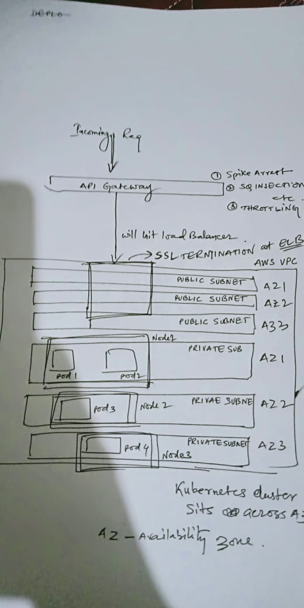

Architecture:

1. API Gateway
  - Spike Arrest
  - SQL injection checks
  - scripting checks

2. Load Balancer
  - sits across Availability Zones (public subnet)
  - L7 Load balancing
  - SSL termination happens here

3. K8s Nodes sits in Private subnet

4. applications are containerized and deployed into the kubernetes cluster. application instances are configured to scale based on cpu utilization.

5. Any external calls by applications happens through a NAT, since nodes sits on private subnet. 
